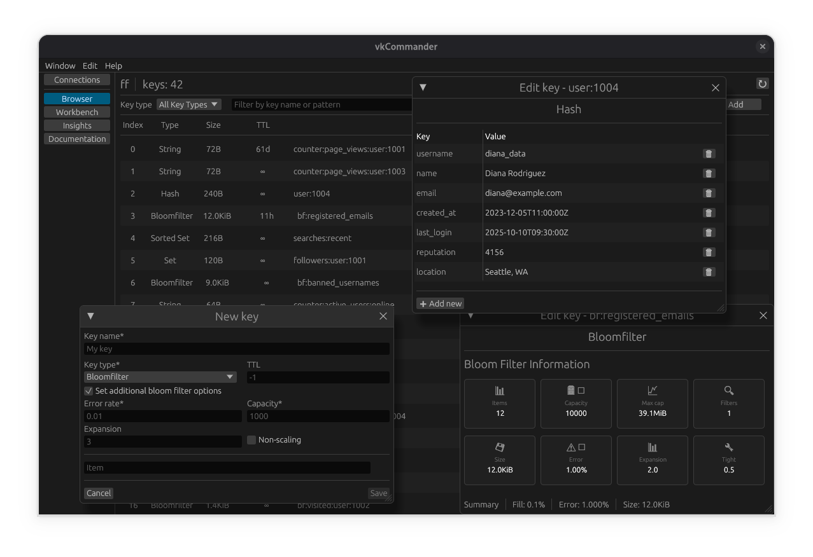
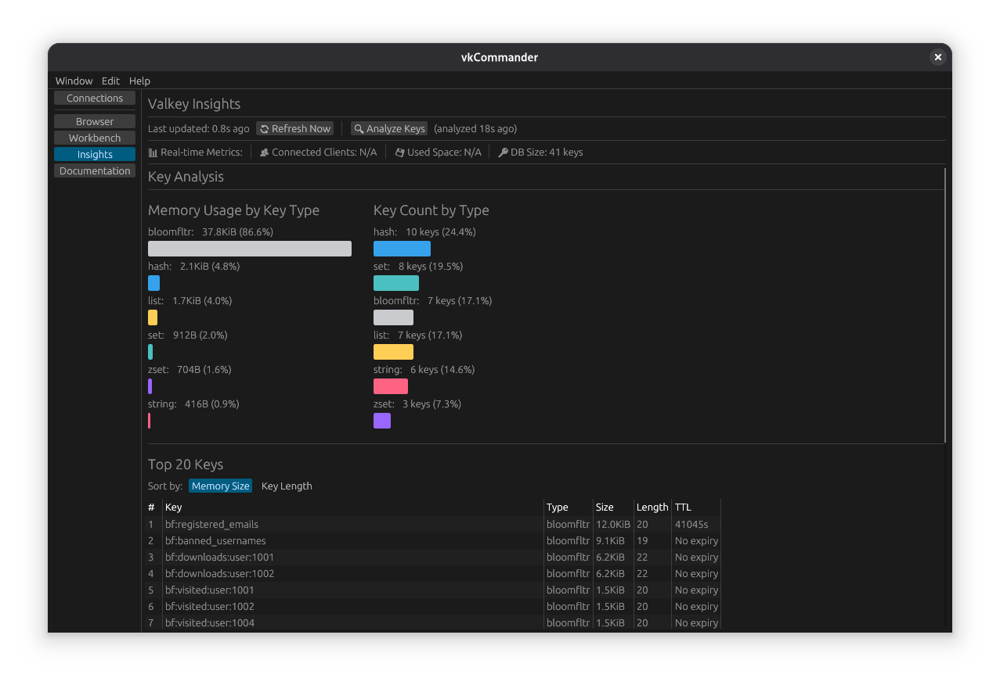

# Valkey Insight

A GUI application for monitoring and analyzing Valkey databases.

## ⚠️ Project Status

This is a **personal project** in a **very early development** stage and under **active** development. It still contains
**a lot of bugs** and **missing features**. Use at your own risk and expect frequent changes.

## About the Author

I'm a professional Rust backend developer, and this is my first attempt at creating a frontend application. As someone
who primarily works on backend systems, this project represents my exploration into GUI development and user interface
design. I'm building this tool to learn frontend development while creating something useful for the Valkey community.

## About the Project

Valkey Insight is a cross-platform desktop application built with Rust and egui, designed to provide insights and
monitoring capabilities for Valkey (and Valkey-compatible) databases. The goal is to create an intuitive, lightweight
tool for database administrators and developers to monitor and interact with their Valkey instances.

**License:** AGPL-3.0

## Screenshots

### Keys Browser and Editor
<a href="screenshots/browser.png" target="_blank">
  
</a>

### Insights and statistics
<a href="screenshots/insights.png" target="_blank">
  
</a>

### Command reference/documentation
<a href="screenshots/documentation.png" target="_blank">
  
</a>

## Prerequisites

To build this project, you need:

- **Rust** 1.90 or later
- **Cargo** (comes with Rust)

### Additional Requirements for Building Packages

#### Linux

- For DEB packages: `dpkg-deb`
- For RPM packages: `rpmbuild`

#### Windows

- For cross-compilation from Linux: `x86_64-pc-windows-gnu` target
- For installer creation: NSIS (`makensis` command)

## Building

### Basic Build

To build the project for your current platform:

```bash
cargo build --release
```

The executable will be located at `target/release/valkey_insight`.

### Linux Packages

To build DEB and RPM packages for Linux:

```bash
./scripts/build_linux.sh
```

This will create:

- `releases/debian/valkey-insight-{VERSION}-1-amd64.deb`
- `releases/fedora/valkey_insight-{VERSION}-1.x86_64.rpm`

### Windows Build

To build a Windows installer (from Linux):

```bash
./scripts/build_windows.sh
```

This will create:

- `releases/windows/valkey-insights-{VERSION}-x64-installer.exe`

Note: Ensure NSIS is installed and the Windows target is added:

```bash
rustup target add x86_64-pc-windows-gnu
```

## Running

After building, you can run the application:

```bash
./target/release/valkey_insight
```

## TODO

The following features need to be implemented:

- **JSON support.** Better handling and visualization of JSON data types
- **Better support for Bloom filters.** Enhanced operations and insights for Bloom filter data structures
- **Support for cluster/sentinel connections.** 
- **Support for secure connections.** Connections to secure instances with SSL or through an SSH tunnel.

## Current Limitations

- Only standalone Valkey connections are currently supported
- Cluster and Sentinel modes are not yet supported/tested
- Many features are still under development

## Contributing

As this is a personal project in early development, contributions, bug reports, and feature requests are welcome, but
please be patient with response times.
